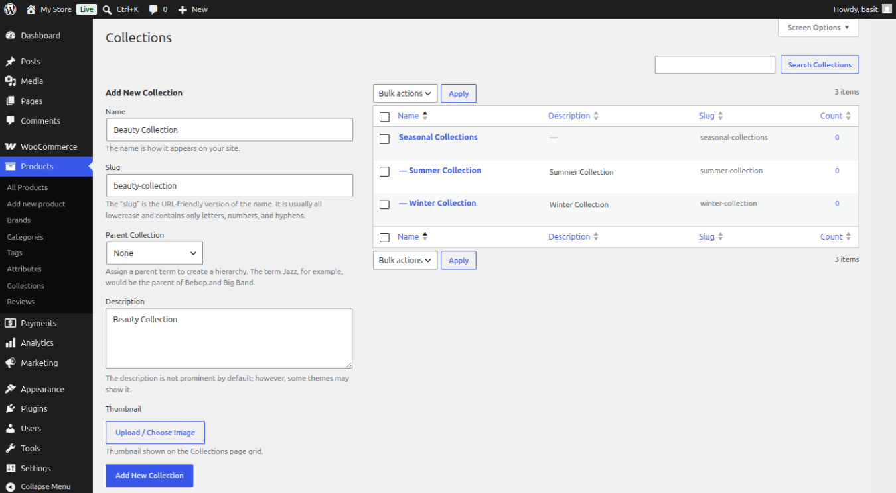
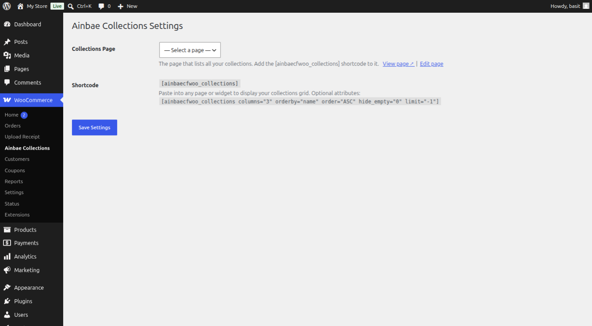
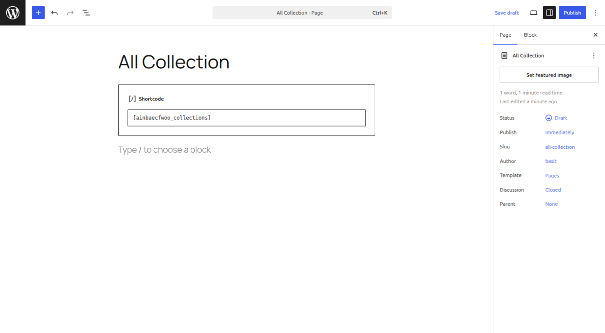
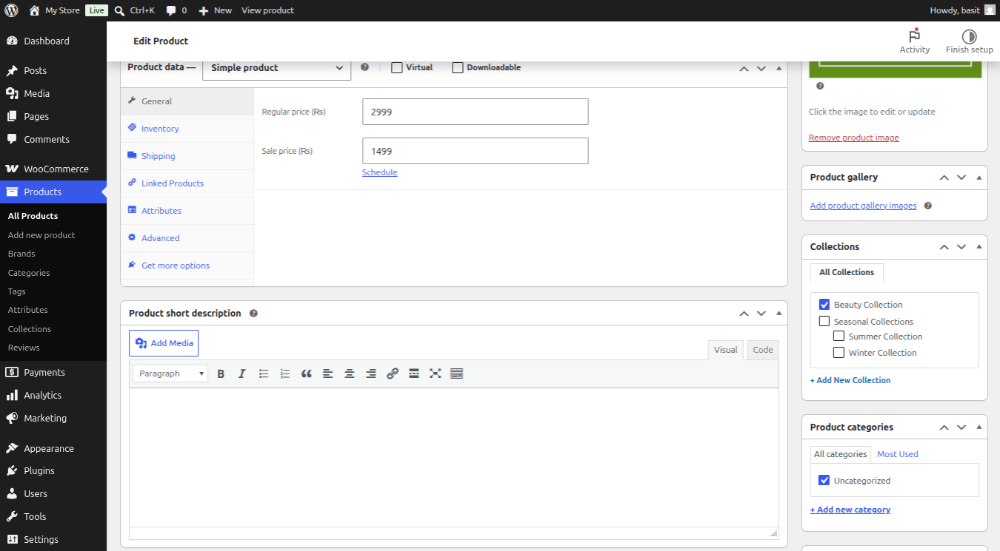
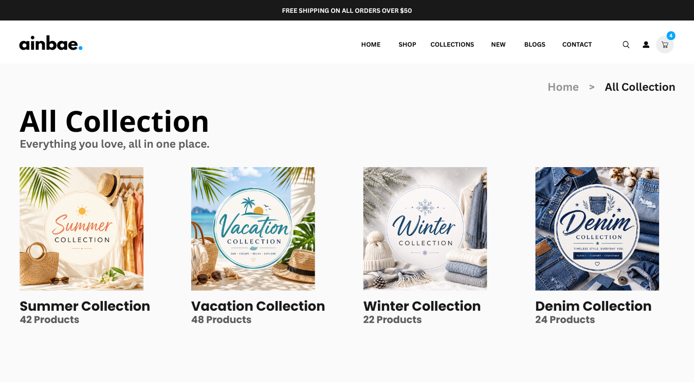
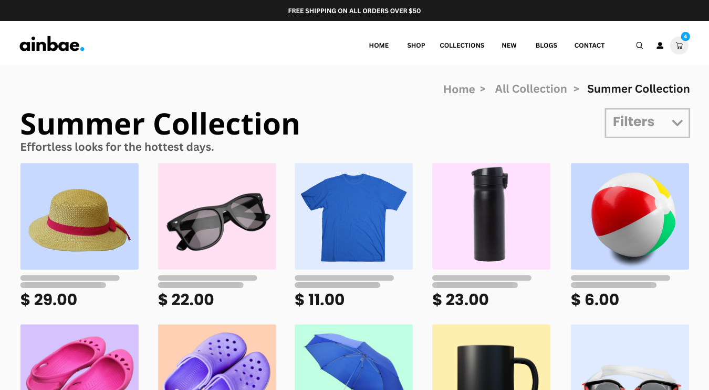

<p align="center">
  
</p>
<h1 align="center">Ainbae Product Collections for WooCommerce</h1>
<p align="center">
  A WooCommerce plugin that adds a <b>Collections</b> taxonomy to your products, working exactly like Product Categories with matching archive layouts, thumbnail support, admin column, and a shortcode-powered landing page.
</p>
<p align="center">
  <a href="https://github.com/ainbaetech/Ainbae-Product-Collections-for-WooCommerce/releases/latest">
    
  </a>
  <a href="https://wordpress.org/plugins/ainbae-product-collections-for-woocommerce/">
    
  </a>
    
  
  
  
</p>

---

## ✨ Features

- **Collections Taxonomy** — Hierarchical taxonomy (parent/child support) mirroring WooCommerce's built-in Product Categories
- **Identical Archive Layout** — Collection archive pages automatically inherit the exact same layout, sidebar, columns, and CSS as your Product Category pages — on every WooCommerce-compatible theme
- **Thumbnail Image Upload** — Add thumbnail images to collections directly from the Add New Collection and Edit Collection admin screens
- **Collections Landing Page** — A `/collections/` page is created automatically on activation with the `[ainbaecfwoo_collections]` shortcode
- **Admin Column** — A single clean "Collections" column in the Products list table with clickable filter links
- **Filter Dropdown** — Filter products by collection from the Products list toolbar
- **Correct Breadcrumbs** — Collection archives include the Collections landing page as a parent breadcrumb
- **No Duplicates** — Exactly one "Collections" menu item under Products, exactly one column — no conflicts
- **Conflict Safe** — Activation detects existing `/collections/` pages and never overwrites them
- **WooCommerce HPOS Compatible** — Fully compatible with High-Performance Order Storage
- **Dedicated Settings Page** — Manage your Collections landing page from WooCommerce → Ainbae Collections
- **Product-to-Collection Assignment** — Assign collections directly from the product editor sidebar
- **Parent/Child Hierarchy** — Full parent and child collection hierarchy in both admin and frontend URLs
- **Responsive Grid Layout** — Collections landing page adapts to any screen size
- **SEO-Friendly URLs** — Clean `/collection/{slug}/` archive URLs registered on activation
- **Works with Classic & Block Themes** — Compatible with classic WooCommerce themes and modern block themes

---

## ⚙️ Installation

### Automatic installation (recommended)

1. Go to **Plugins → Add New** in your WordPress admin.
2. Search for **Ainbae Product Collections for WooCommerce**.
3. Click **Install Now** then **Activate**.
4. Go to **Products → Collections** to create your first collection
5. Assign collections to products from the product edit screen sidebar

### Manual installation

1. [Download the latest release](https://github.com/ainbaetech/Ainbae-Product-Collections-for-WooCommerce/releases/latest) zip file.
2. Go to **Plugins → Add New → Upload Plugin** and upload the zip.
3. Click **Activate Plugin**.
4. Go to **Products → Collections** to create your first collection
5. Assign collections to products from the product edit screen sidebar

### Requirements

| Requirement | Version       |
| ----------- | ------------- |
| WordPress   | 5.8 or higher |
| WooCommerce | 6.0 or higher |
| PHP         | 7.4 or higher |

---

## 🚀 Getting Started

After activation the plugin automatically:

1. Registers the **Collections** taxonomy under your Products
2. Creates a **Collections** page at `/collections/` with the `[ainbaecfwoo_collections]` shortcode
3. Adds a **Collections** submenu item under **Products** in the admin sidebar
4. Adds a **Collections** column to the Products list table

Go to **WooCommerce → Ainbae Collections** to configure the Collections page setting.

---

## 🖼️ Screenshots

### 1. Admin Settings — Collections Management



Collections management screen with hierarchy support and thumbnail uploads.

---

### 2. Frontend — Collections Landing Page Setting



Ainbae Collections settings page for selecting the collections landing page.

---

### 3. Collections Landing Page — Shortcode Display



Collections page created using the `[ainbaecfwoo_collections]` shortcode.

---

### 4. Product Editor — Assigning Collections



Product editor sidebar showing collection assignment options.

---

### 5. Frontend — Collection Page Displaying Collection



Frontend collections landing page displaying collection thumbnails and product counts.

---

### 6. Frontend - Showing Collection Products



Individual collection archive page displaying products using the active theme's WooCommerce layout.

---

## 🗂️ Managing Collections

### Adding a Collection

1. Go to **Products → Collections**
2. Enter a name, slug, optional description, optional parent collection, and a thumbnail image
3. Click **Add New Collection**

### Assigning Products to a Collection

1. Open any product for editing
2. In the right sidebar find the **Collections** meta box (below Categories)
3. Check the collection(s) you want to assign and save the product

### Collection Archive URL

Each collection gets its own archive page at:

```
https://yoursite.com/collection/{collection-slug}/
```

This page inherits the exact layout of your Product Category pages automatically.

---

## 🔖 Shortcode

Use `[ainbaecfwoo_collections]` on any page or widget to display a grid of all your collections.

```
[ainbaecfwoo_collections]
```

### Shortcode Attributes

| Attribute    | Default | Description                                     |
| ------------ | ------- | ----------------------------------------------- |
| `columns`    | `3`     | Number of grid columns (1–6)                    |
| `orderby`    | `name`  | Sort by: `name`, `count`, `slug`, `term_id`     |
| `order`      | `ASC`   | Sort direction: `ASC` or `DESC`                 |
| `hide_empty` | `0`     | Set to `1` to hide collections with no products |
| `limit`      | `-1`    | Max collections to show. `-1` shows all         |

### Examples

```
[ainbaecfwoo_collections columns="4"]
[ainbaecfwoo_collections orderby="count" order="DESC" hide_empty="1"]
[ainbaecfwoo_collections limit="6" columns="3"]
```

---

## 🌍 How Archive Layout Matching Works

Most WooCommerce themes (Astra, Flatsome, OceanWP, Storefront, etc.) use the PHP function `is_product_category()` to decide the layout for archive pages — sidebar width, column count, CSS classes. This function only returns `true` for the built-in `product_cat` taxonomy.

This plugin solves this at `template_redirect` priority 5 (before the theme fires at 10) by temporarily setting the queried taxonomy to `product_cat`. This makes `is_product_category()` return `true` for the entire render, so themes apply **exactly** the same layout they use for Product Category pages — automatically, on every theme, without any configuration.

A `term_link` filter ensures all collection URLs still correctly point to `/collection/…` rather than `/product-category/…`.

---

## ⚙️ Settings

Go to **WooCommerce → Ainbae Collections** to:

- Select which page acts as the **Collections landing page** (where `[ainbaecfwoo_collections]` displays the grid)
- View the shortcode reference and attribute documentation

---

## 🔄 Changelog

### 1.2.2
- **Updated** - readme.txt `WC tested up to` updated to 11.1.0
- **Updated** - readme.txt `Tested up to` updated to 7.1

### 1.2.1

- **Fix** — Shortcode collection cards now inherit full WooCommerce/theme grid layout, matching product category card sizing and alignment exactly
- **Fix** — Removed sort arrows from the Collections column in the Products list — now matches the native Categories column behaviour
- **Updated** — readme.txt expanded with features, How It Works guide, Screenshots, Perfect For section, and additional FAQs
- **Updated** — POT file corrected: wrong file references fixed, missing strings added, stale line numbers updated

### 1.2.0

- **Fix** — Collection archive pages now inherit exact layout from Product Category pages on every theme
- **Fix** — All text domains corrected (`ainbae-product-collections-for-woocommerce`)
- **Fix** — Unescaped output errors resolved in settings page
- **Fix** — Removed unprefixed hook name
- **Fix** — Replaced slow meta_query with direct DB query for conflict detection
- **Fix** — Added `/languages/` directory with proper index.php
- **Fix** — readme.txt `Tested up to` updated to 6.9
- **New** — Thumbnail image upload field on **Add New Collection** screen
- **New** — `term_link` filter keeps `/collection/` URLs correct after layout spoof

### 1.1.0

- **Fix** — Collections no longer appeared twice in the Products admin menu
- **Fix** — Only one "Collections" column in the Products list table
- **Fix** — Collection archive pages use same template as Product Category pages
- **New** — `[ainbaecfwoo_collections]` shortcode for collections landing page
- **New** — Conflict-safe page creation on activation
- **New** — WooCommerce → Ainbae Collections settings page

### 1.0.0

- Initial release

---

## 🤝 Contributing

Pull requests are welcome. For major changes please open an issue first to discuss what you would like to change.

1. Fork the repository
2. Create your feature branch: `git checkout -b feature/your-feature`
3. Commit your changes: `git commit -m 'Add your feature'`
4. Push to the branch: `git push origin feature/your-feature`
5. Open a Pull Request

---

## 📄 License

This plugin is licensed under the [GPL-2.0-or-later](https://www.gnu.org/licenses/gpl-2.0.html) license.

---

## 🏢 About Ainbae

Built and maintained by [Ainbae](https://www.ainbae.com).

## ⭐ Support

If this plugin helps your store, please consider:

- Giving it a ⭐ on [GitHub](https://github.com/ainbaetech/Ainbae-Product-Collections-for-WooCommerce)
- Leaving a review on [WordPress.org](https://wordpress.org/plugins/ainbae-product-collections-for-woocommerce/)
- Reporting bugs via [GitHub Issues](https://github.com/ainbaetech/Ainbae-Product-Collections-for-WooCommerce/issues)
